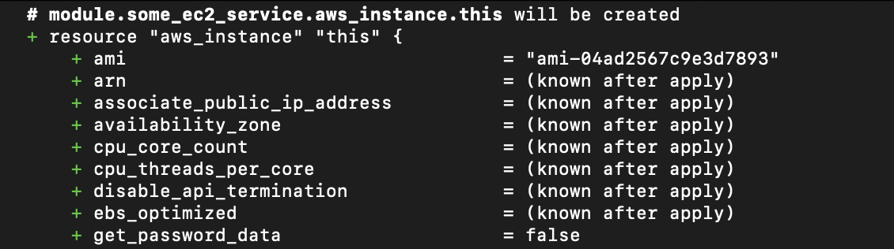
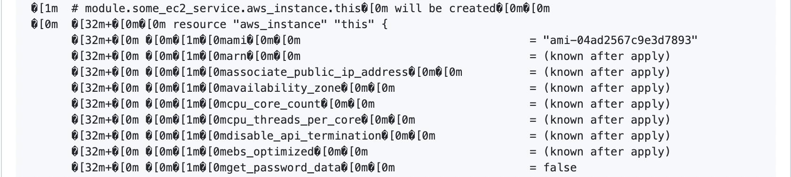
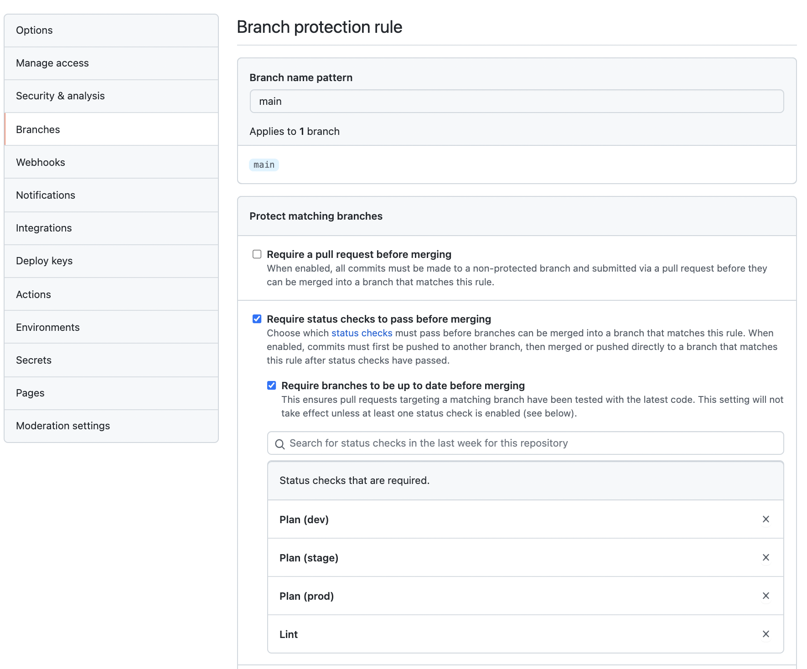

# Elevate Your Terraform Workflow with GitHub Actions

I've recently had the great opportunity to work with [Pathstream](https://www.pathstream.com/) on their infrastructure automation. We experimented with using GitHub Actions, Terraform, and AWS together in a [GitOps](https://about.gitlab.com/topics/gitops/)-style workflow. The results are compelling and worth sharing so I built a small [example repo](https://github.com/walkerab/terraform-plus-github-actions) to demonstrate some of our findings. You can find all of the code from this post in the repo.

First we'll cover some of the basics of GitHub actions, then we'll dig into building two distinct GitHub Action workflows. One to cover the `terraform plan` phase and another to cover the `terraform apply` phase.

Highlights:

- GitHub Actions + Terraform
- Multi-environment
- Enhanced formatting on the `terraform plan` output
- Branch protection

## What Does it Do?

The code herein fits the use case of your average GitOps workflow for Terraform:

1. Develop code against a feature branch and locally run `terraform plan` as you make changes
2. When you are happy with the plan description create a PR against the main branch in GitHub
3. GitHub Actions will generate a Terraform plan and put it in the PR comments for review
4. Once the code and the plan output is reviewed and accepted it is merged to the main branch
5. GitHub Actions will run `terraform apply` using the approved plan

## The Terraform Bits

The [Terraform code](https://github.com/walkerab/terraform-plus-github-actions/tree/main/terraform) is fairly irrelevant. It's there as a placeholder just so there is _something_ to run the workflows against. It creates a dummy application that consists of a single EC2 instance. It's deployed into three virtually identical environments: dev, stage, and prod.

All we need to know is that it takes a single input variable to restrict which account the code will be run against.

```hcl
variable "allowed_account_id" {
  description = "The id of the one AWS account this code is permitted to run against"
  type        = string
}

provider "aws" {
  region              = "us-east-1"
  allowed_account_ids = [var.allowed_account_id]

  ...
}
```

## Workflows

What we really want to exhibit is the [workflows](https://docs.github.com/en/actions/learn-github-actions/understanding-github-actions#workflows). We are going to make two of them:

1. When a PR is created against the `main` branch (or when a PR is updated) we want to run `terraform plan`
2. When a PR is merged to the `main` branch we want to run `terraform apply`

We will start simple - such that the code runs - and than progressively throw on enhancements like shorter plan messages, and colored diffs.

### Primer on GitHub Actions

If you aren't familiar with GitHub Actions here is a little bit to help you follow along.

There is a hierarchy. At the top level we have [workflows](https://docs.github.com/en/actions/learn-github-actions/understanding-github-actions#workflows). They are triggered by events like pushing to the main branch or creating a pull request. They can also be manually triggered through the GitHub UI.

Under that we have [jobs](https://docs.github.com/en/actions/learn-github-actions/understanding-github-actions#jobs). Jobs create individual "runners" - you can think of them as VMs.

Under jobs we have [steps](https://docs.github.com/en/actions/learn-github-actions/understanding-github-actions#steps). Steps run on said VMS and can share files and env vars as they are on the same machine

Workflows contain one or more jobs while jobs contain one or more steps. For each job there is a VM created and then its steps execute on said VM.

For some of our jobs we will employ the [matrix strategy](https://docs.github.com/en/actions/learn-github-actions/workflow-syntax-for-github-actions#jobsjob_idstrategymatrix). This takes one job definition and creates multiple separate jobs that can execute in parallel.

## Lint

Before we do a full `terraform plan` let's do something a little easier. Let's make it so when we create a PR against the main branch it will run `terraform fmt` and let us know if our code complies with canonical format and style.

Create a workflow file at `.github/workflows/plan-on-pr.yml` like this:

```yaml
name: Plan / Test On PR

on:
  pull_request:
    branches:
      - main

jobs:
  lint:
    name: Lint
    runs-on: ubuntu-20.04
    steps:
      - name: Check out code
        uses: actions/checkout@v2

      - name: Setup Terraform
        uses: hashicorp/setup-terraform@v1
        with:
          terraform_version: 1.0.9

      - name: Run terraform fmt check
        run: terraform fmt -check -diff -recursive ./terraform
```

The workflow is triggered by the event of a pull request being made against the main branch. Subsequent pushes to the feature branch will also trigger this workflow. This is part of the default behavior for the [`pull_request` event trigger](https://docs.github.com/en/actions/learn-github-actions/events-that-trigger-workflows#pull_request). This is useful for example if we create a PR and then it fails the linting step. We can make our code changes and run `git push` again to re-trigger the check.

There is currently only one job in this workflow, `lint`. (Note that we could have called it anything. `lint` is just the identifier for the job in case we need to reference it elsewhere.) It creates an ubuntu-20.04 VM with three steps that will execute on it.

The first step is incredibly common. It uses [actions/checkout@v2](https://github.com/actions/checkout) which by default checks out the code of the branch you are making the PR from - i.e. your feature branch. It fetches only a single commit from the head of the branch and so is quite performant.

The next step installs Terraform on the VM using [hashicorp/setup-terraform](https://github.com/hashicorp/setup-terraform). It also does a couple extra things but we'll come back to that.

The last step is a simple run statement. It executes a shell script with [terraform fmt](https://www.terraform.io/docs/cli/commands/fmt.html) which will check if the code is formatted correctly or not. If it's not, the step will fail and will cause the job containing it to also fail. This is the default behavior for jobs and steps. If any step fails it will break the execution of the job.

## Plan

For the next job in the workflow we will execute `terraform plan`. This is different than the last job in that we want to execute the command once for each of our three environments (root modules): dev, stage, and prod. We then want to capture the output of the command and put it into the PR comments for review.

Also a key difference is that the plan action has to connect with some real-world infrastructure to detect the differences between our code, the state, and what we actually have running in AWS. This will require AWS credentials to be fed in.

Here's what it looks like:

````yaml
jobs:

  # ... lint removed for brevity

  plan:
    name: Plan
    env:
      TF_VAR_allowed_account_id: ${{ secrets.ALLOWED_ACCOUNT_ID }}
    runs-on: ubuntu-20.04
    strategy:
      fail-fast: false
      matrix:
        path:
          - dev
          - stage
          - prod

    steps:
      - name: Check out code
        uses: actions/checkout@v2

      - name: Setup Terraform
        uses: hashicorp/setup-terraform@v1
        with:
          terraform_version: 1.0.9

      - name: Configure AWS Credentials
        uses: aws-actions/configure-aws-credentials@v1
        with:
          aws-region: us-east-1
          aws-access-key-id: ${{ secrets.AWS_ACCESS_KEY_ID }}
          aws-secret-access-key: ${{ secrets.AWS_SECRET_ACCESS_KEY }}

      - name: Initialize Terraform
        run: |
          cd terraform/${{ matrix.path }}
          terraform init -input=false

      - name: Plan Terraform
        id: plan
        continue-on-error: true
        run: |
          cd terraform/${{ matrix.path }}
          terraform plan -input=false -no-color

      - name: Post Plan to GitHub PR
        uses: mshick/add-pr-comment@v1
        with:
          allow-repeats: true
          repo-token: ${{ secrets.GITHUB_TOKEN }}
          repo-token-user-login: 'github-actions[bot]'
          message: |
            ## ${{ matrix.path }} plan
            ```
            ${{ steps.plan.outputs.stdout || steps.plan.outputs.stderr }}
            ```
````

We are setting an [environment variable](https://docs.github.com/en/actions/learn-github-actions/workflow-syntax-for-github-actions#env) on the VM, `TF_VAR_allowed_account_id`. This follows the [Terraform input variable naming scheme](https://www.terraform.io/docs/language/values/variables.html#environment-variables) and so will be picked up by any Terraform CLI operations and fed into our root modules' "allowed_account_id" variable.

Note that we explicitly set this value to prevent accidentally running our code against the wrong account. Believe me it happens!

The [matrix strategy](https://docs.github.com/en/actions/learn-github-actions/workflow-syntax-for-github-actions#jobsjob_idstrategymatrix) is being used so that we create three distinct jobs from one job definition. These will spin up in parallel and be fed a `matrix.path` variable to differentiate them.

We've also set `fail-fast: false`. [This option](https://docs.github.com/en/actions/learn-github-actions/workflow-syntax-for-github-actions#jobsjob_idstrategyfail-fast) will make it so if any one job fails it will not cancel any other in-progress jobs. Potentially `terraform plan` could fail for one environment and not the other ones. We still want to see the results of `terraform plan` for all environments even if one of them is failing.

The first two steps (checkout and setup) you should already be familiar with so let's move onto the third step. It's using [aws-actions/configure-aws-credentials](https://github.com/aws-actions/configure-aws-credentials) to set the appropriate AWS environment variables. That's it really.

The fourth step is where it starts to get interesting. We are running some shell script to initialize Terraform. Notice how we inject `${{ matrix.path }}` in the script so that it will select a different working directory depending on which environment the job is running for.

We set `-input=false` because we want [Terraform to know this is non-interactive](https://learn.hashicorp.com/tutorials/terraform/automate-terraform?in=terraform/automation#automated-terraform-cli-workflow). We don't want it to potentially ask for human input and cause the GitHub Action runner to hang indefinitely.

Then we get to the `plan` step and there are a few things to note. We have added an `id` to this step so that it can be referenced in the next step. We have also explicitly set [continue-on-error](https://docs.github.com/en/actions/learn-github-actions/workflow-syntax-for-github-actions#jobsjob_idstepscontinue-on-error) to `true`. If we didn't set this it would default to `false` meaning that if the plan step were to fail for any reason the job would not advance to the next step. We _do_ want it to advance to the next step so we can be able to see _why_ the plan may have failed.

The `-no-color` flag is set because we only want plain-text output. This will remove the terminal formatting sequences. Although they look nice in a terminal and make the `+` show as green and the `-` show as red etc, they will look like gobbledygook inside of a PR comment.




We will re-introduce color into the output further down.

The last step uses an action I'm particularly fond of, [mshick/add-pr-comment](https://github.com/mshick/add-pr-comment). It has an option to allow repeated comments that are identical. This is useful because you may run multiple plans on the same PR with identical output. That's not what I love about this action though. The big selling point is that it can make comments from workflows that aren't triggered from PRs. This isn't advantageous just yet but it will be when we create a workflow for `terraform apply`.

Inside the `message` of the last action we are referencing `steps.plan.outputs.stdout` and `steps.plan.outputs.stderr`. These are made available to us by the [hashicorp/setup-terraform](https://github.com/hashicorp/setup-terraform) step we ran earlier. It installs a wrapper script around the Terraform binary which exposes STDOUT and STDERR as outputs. This is the notable functionality I alluded to earlier. This is not something normally available on steps. I wish it was though! It's so handy not having to [explicitly define outputs](https://docs.github.com/en/actions/learn-github-actions/workflow-commands-for-github-actions#setting-an-output-parameter). Especially since it won't let you assign multi-line strings to the outputs without [some serious trickery](https://trstringer.com/github-actions-multiline-strings/)!

The two outputs are [logically ORed](https://docs.github.com/en/actions/learn-github-actions/expressions#operators) together so that if `steps.plan.outputs.stdout` is not available it will show `steps.plan.outputs.stderr` instead. This is what will happen if `terraform plan` fails for any reason.

## Improvements to Plan Output

Now if we create a PR we will get a plan comment that looks something like this:


This isn't bad but we can do better.

### Remove Refresh Messages

If you've ever worked with a large Terraform module you know that the "Refreshing state..." lines can go on and on and on. There can often be hundreds of lines saying this. When reviewing plan output these messages are not useful so lets strip them out.

Note that we do still want refresh to run (it's essential). We simply don't want to see its output in our plan message.

The traditional workaround for this has been like so:

```sh
terraform refresh 2>&1 > /dev/null && terraform plan -refresh=false
```

You separate the refresh and plan commands out and redirect the refresh output to `/dev/null` to get rid of it.

Unfortunately the [refresh command](https://www.terraform.io/docs/cli/commands/refresh.html) is deprecated now so using this workaround is not future compatible.

A new [workaround](https://github.com/hashicorp/terraform/issues/27214#issuecomment-742809948) has surfaced that looks like this:

```sh
terraform plan >/dev/null -out=tfplan
terraform show tfplan
```

It redirects all of the command's output to `/dev/null` and then opts to [make a binary of the plan](https://www.terraform.io/docs/cli/commands/plan.html#out-filename). The binary can then be read into the `terraform show` command and it will display essentially the same thing as `terraform plan` would have minus the "Refreshing state..." messages.

For our use case we want to do it slightly differently:

```sh
terraform plan -input=false -no-color -out=tfplan \
&& terraform show -no-color tfplan
```

We don't want `terraform show` running if `terraform plan` has failed as there will be no `tfplan` file generated to run against. So we throw in a `&&` to short-circuit things if the first command fails. 

We also removed the redirect to `/dev/null`. This seems counter-intuitive to our goal of suppressing the output from `terraform plan` but since the [hashicorp/setup-terraform](https://github.com/hashicorp/setup-terraform) wrapper for STDOUT/STDERR only captures the _last_ Terraform command run in a given action we don't need to suppress the output.

### Re-Introduce Colors

Normally `terraform plan` output is colorized using [terminal formatting sequences](https://en.wikipedia.org/wiki/ANSI_escape_code). We've intentionally removed this using `-no-color` as it's not compatible with the plain text we are putting in PR comments. We do however have another option for getting color text, [code blocks in diff syntax](https://github.com/github/markup/issues/1440#issuecomment-803889380).

It's not well documented (or documented at all), but in PR comments you can make something like this:

````
```diff
+ Green
- Red
! Orange
@@ Pink @@
# Gray
...
````

and it will show up like this:


We can leverage this to bring some coloring back to our plan messages. It won't be the same style of coloring but it will at least have the intended effect of placing attention where it needs to be.

Note that the character that controls the color **must be at the beginning of the line** in order for it to do anything. Otherwise the line will continue to show as plain text. Terraform indents all of its plan output so we will need to move the control characters to the front of the line.

Let's add another step between the plan and the comment to reformat the output:

```yaml
      - name: Reformat Plan
        run: |
          echo '${{ steps.plan.outputs.stdout || steps.plan.outputs.stderr }}' \
          | sed -E 's/^([[:space:]]+)([-+])/\2\1/g' > plan.txt
```

`sed` is taking all lines that begin with one or more spaces followed by a `+` or `-`. It stores the amount of spaces in `\1` and the +/- in `\2`. Then replace that portion of the line with `\2\1` (+/- followed by the number of matched spaces). We've redirected the output to a file so it's accessible downstream.

The add-pr-comment action will need to reference what's in `plan.txt`. It lacks the functionality to this directly though. It can only reference variables that come in through [contexts](https://docs.github.com/en/actions/learn-github-actions/contexts).

Let's add yet another step. This time to put the contents of `plan.txt` into [the env context](https://docs.github.com/en/actions/learn-github-actions/contexts#env-context). This is tricky because of the aforementioned [limitations of multi-line assignments to outputs and env vars](https://trstringer.com/github-actions-multiline-strings/).

```yaml
      - name: Put Plan in Env Var
        run: |
          PLAN=$(cat plan.txt)
          echo "PLAN<<EOF" >> $GITHUB_ENV
          echo "$PLAN" >> $GITHUB_ENV
          echo "EOF" >> $GITHUB_ENV
```

[This method](https://docs.github.com/en/actions/learn-github-actions/workflow-commands-for-github-actions#multiline-strings) essentially constructs a [heredoc](https://tldp.org/LDP/abs/html/here-docs.html) inside of an environment variable.

So altogether the last four steps look like this:

````yaml
      - name: Plan Terraform
        id: plan
        continue-on-error: true
        run: |
          cd terraform/${{ matrix.path }}
          terraform plan -input=false -no-color -out=tfplan \
          && terraform show -no-color tfplan

      - name: Reformat Plan
        run: |
          echo '${{ steps.plan.outputs.stdout || steps.plan.outputs.stderr }}' \
          | sed -E 's/^([[:space:]]+)([-+])/\2\1/g' > plan.txt

      - name: Put Plan in Env Var
        run: |
          PLAN=$(cat plan.txt)
          echo "PLAN<<EOF" >> $GITHUB_ENV
          echo "$PLAN" >> $GITHUB_ENV
          echo "EOF" >> $GITHUB_ENV

      - name: Post Plan to GitHub PR
        uses: mshick/add-pr-comment@v1
        with:
          allow-repeats: true
          repo-token: ${{ secrets.GITHUB_TOKEN }}
          repo-token-user-login: 'github-actions[bot]'
          message: |
            ## ${{ matrix.path }} plan
            ```diff
            ${{ env.PLAN }}
            ```
````

Notice how we've referenced `env.PLAN` from the [GitHub env context](https://docs.github.com/en/actions/learn-github-actions/contexts#env-context) and it's been place inside of a diff code block.

Plan output will now appear on PRs without the "Refreshing state..." messages and with some nice colors to highlight important changes.


## Branch Protection

Before we go any further we need to discuss branch protection.

[Branch protection](https://docs.github.com/en/repositories/configuring-branches-and-merges-in-your-repository/defining-the-mergeability-of-pull-requests/about-protected-branches#require-status-checks-before-merging) is an optional feature on GitHub repos that ... you guessed it: protects branches. We want to protect the main branch in two ways:

1. Ensure all plan steps are successful before we can merge
2. Ensure the plans we see are up-to-date before we merge

This can easily be achieved by enabling ["Require status checks before merging"
](https://docs.github.com/en/repositories/configuring-branches-and-merges-in-your-repository/defining-the-mergeability-of-pull-requests/about-protected-branches#require-status-checks-before-merging) and setting it to "Require branches to be up to date before merging".



**I cannot emphasize enough that you should not be using the workflows we've created here without these branch protection settings enabled!**

### Why? Why is branch protection so important?

The next workflow we create will run `terraform apply` once the "Merge" button is clicked on the PR. It is going to run unsupervised and will just apply whatever changes it sees without asking us if it should or not.

We don't want to merge code that hasn't passed our lint check. We don't want to apply code that fails planning. Most importantly we need the plan that we see and approve on the PR to be the plan that `terraform apply` actually runs.

Imagine this scenario: you create a PR that doesn't result in any actual infrastructure changes. Let's say there were some hard-coded database names and you switched them to using a shared naming module to DRY things up. While your PR is waiting for review your colleague makes another PR that actually changes the behavior of said naming module - it now puts a UUID at the end of every name. It gets approved and merged. Now the plan on your initial PR is out of date. It's not going to show you that when you hit merge your databases will be destroyed and re-created with different names. 🧨

Having the branch protection rule, "Require branches to be up to date before merging", will guard against scenarios like this as it will not allow merging into main if another PR has been merged in the meantime.

NOTE: Branch protection will only guard you from changes coming in through GitHub. We still need to watch out for external changes to infrastructure and Terraform state. I plan to cover this more in a follow-up post.

## Apply

Now let's make it so when there is a merge to main, `terraform apply` will be run. This workflow will require much less explaining than the one for `terraform plan`. We will be straight-up recycling some code from the previous workflow.

````yaml
name: Plan / Apply On Merge

on:
  push:
    branches:
      - main

jobs:
  inform_about_apply:
    name: Inform About Apply
    runs-on: ubuntu-20.04

    steps:
      - name: Inform on PR that Apply is Running
        uses: mshick/add-pr-comment@v1
        with:
          repo-token: ${{ secrets.GITHUB_TOKEN }}
          repo-token-user-login: 'github-actions[bot]'
          message: |
            ***Running terraform apply***
            Results will display here momentarily...

  plan_and_apply:
    name: Plan and Apply
    env:
      TF_VAR_allowed_account_id: ${{ secrets.ALLOWED_ACCOUNT_ID }}
    runs-on: ubuntu-20.04
    strategy:
      fail-fast: false
      matrix:
        path:
          - dev
          - stage
          - prod

    steps:
      - name: Check out code
        uses: actions/checkout@v2

      - name: Setup Terraform
        uses: hashicorp/setup-terraform@v1
        with:
          terraform_version: 1.0.9

      - name: Configure AWS Credentials
        uses: aws-actions/configure-aws-credentials@v1
        with:
          aws-region: us-east-1
          aws-access-key-id: ${{ secrets.AWS_ACCESS_KEY_ID }}
          aws-secret-access-key: ${{ secrets.AWS_SECRET_ACCESS_KEY }}

      - name: Initialize Terraform
        run: |
          cd terraform/${{ matrix.path }}
          terraform init -input=false

      - name: Plan Terraform
        id: plan
        continue-on-error: true
        run: |
          cd terraform/${{ matrix.path }}
          terraform plan -input=false -no-color -out=tfplan \
          && terraform show -no-color tfplan

      # Sed is taking all lines that begin with one or more spaces followed by a `+` or `-`.
      # It stores the amount of spaces in `\1` and the +/- in `\2`.
      # Then replace that portion of the line with `\2\1` (+/- followed by the number of matched spaces).
      - name: Reformat Plan
        if: steps.plan.outcome == 'success'
        run: |
          echo '${{ steps.plan.outputs.stdout || steps.plan.outputs.stderr }}' \
          | sed -E 's/^([[:space:]]+)([-+])/\2\1/g' > plan.txt

      - name: Put Plan in Env Var
        if: steps.plan.outcome == 'success'
        run: |
          PLAN=$(cat plan.txt)
          echo "PLAN<<EOF" >> $GITHUB_ENV
          echo "$PLAN" >> $GITHUB_ENV
          echo "EOF" >> $GITHUB_ENV

      - name: Apply Terraform
        if: steps.plan.outcome == 'success'
        id: apply
        continue-on-error: true
        run: |
          cd terraform/${{ matrix.path }}
          terraform apply \
            -input=false \
            -no-color \
            tfplan

      - name: Post Plan and Apply to GitHub PR
        if: steps.plan.outcome == 'success' && steps.apply.outcome == 'success'
        uses: mshick/add-pr-comment@v1
        with:
          repo-token: ${{ secrets.GITHUB_TOKEN }}
          repo-token-user-login: 'github-actions[bot]'
          message: |
            Applying **${{ matrix.path }}**:

            ```diff
            ${{ env.PLAN }}
            ```

            ```
            ${{ steps.apply.outputs.stdout }}
            ```

      - name: Post Plan Failure
        if: steps.plan.outcome == 'failure'
        uses: mshick/add-pr-comment@v1
        with:
          repo-token: ${{ secrets.GITHUB_TOKEN }}
          repo-token-user-login: 'github-actions[bot]'
          message: |
            Plan failed for **${{ matrix.path }}**:

            ```
            ${{ steps.plan.outputs.stderr }}
            ```

      - name: Post Apply Failure
        if: steps.apply.outcome == 'failure'
        uses: mshick/add-pr-comment@v1
        with:
          repo-token: ${{ secrets.GITHUB_TOKEN }}
          repo-token-user-login: 'github-actions[bot]'
          message: |
            Apply failed for **${{ matrix.path }}**:

            ```
            ${{ steps.apply.outputs.stderr }}
            ```
```` 

At the top we can see this workflow is [triggered by a push](https://docs.github.com/en/actions/learn-github-actions/events-that-trigger-workflows#push). When someone hits "Merge", GitHub will perform a merge and then a push in the background so this is effectively what we want. (there isn't a "merge" event we can hook onto)

There is a job to announce that the apply process is running. This is just for UX as it can take several minutes for the actual results of the apply to appear. It makes it so there is immediate feedback right after hitting "Merge" and you don't have to sit there wondering "did it work?"

This workflow is where the [mshick/add-pr-comment](https://github.com/mshick/add-pr-comment) action really shines. [It contains logic to find the relevant PR to comment on](https://github.com/mshick/add-pr-comment/blob/master/src/main.ts#L134). This is the only commenting action I've come across that supports this. The other ones will error out saying that they aren't in the context of a PR.

The workflow has some control flow logic as there are three outcomes we need to check for:

- The plan fails
- The plan succeeds and the apply fails
- Both the plan and the apply succeed

We use [if conditionals](https://docs.github.com/en/actions/learn-github-actions/workflow-syntax-for-github-actions#jobsjob_idstepsif) to check the [steps context](https://docs.github.com/en/actions/learn-github-actions/contexts#steps-context) so only the appropriate steps are executed.

## Conclusion

So there you have it. An example of using Terraform + AWS in a CI/CD pipeline built with GitHub Actions.

This is still a WIP so expect a follow-up. I can think of several ways I'd like to improve upon this code. In particular:

- Protecting against Terraform state manipulation that could be occurring outside of the GitOps workflow i.e. saving the `tfplan` into S3 so it can be used in the apply. This combined with [branch protection](https://docs.github.com/en/repositories/configuring-branches-and-merges-in-your-repository/defining-the-mergeability-of-pull-requests/about-protected-branches#require-status-checks-before-merging) would make things very safe.
- DRYing code up using [composite actions](https://docs.github.com/en/actions/creating-actions/creating-a-composite-action)
- Removing hard-coded Terraform version number and Ubuntu versions
- Trigger workflows on comments - for example we could re-run the workflows when someone comments "plan" or "apply" similar to how [Atlantis](https://www.runatlantis.io/docs/using-atlantis.html#atlantis-apply) operates.
- Making the example run for multiple AWS accounts not just multiple environments
- Grouping comments together to cut down on noise

What would you explore next? Reach out to me and let me know!